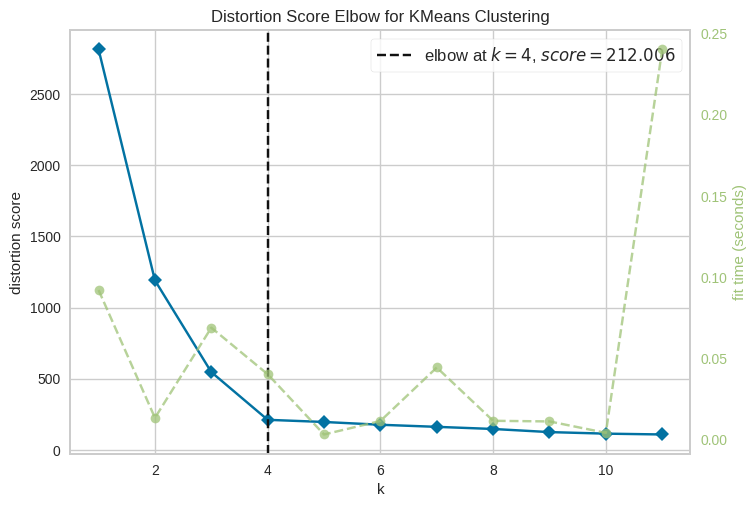
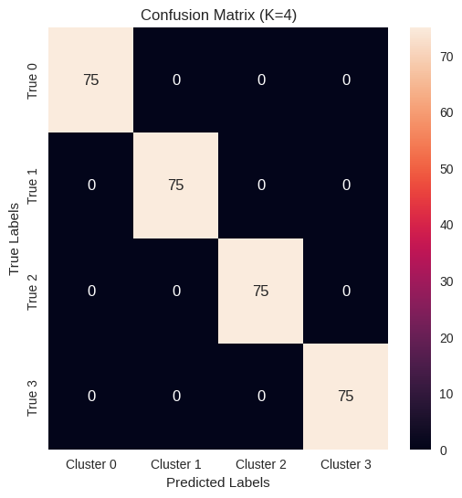

# GROUP HW2

## Team member names and email addresses
- Shemar Allen(allens21@students.ecu.edu)
- Safa Asrar(asrars20@students.ecu.edu)
- Abid Haq(haqa19@students.ecu.edu)

## Quick Start
Run the following command in the termainal to install all dependencies:

`pip3 install scikit-learn yellowbrick seaborn numpy matplotlib`

## Which K works the best
The best k-value was found to be k=4 through using our elbow graph. 

## The best K accuracy
Our best K (k=4) has a distorion score of about 520 out of 3000 which is relatively low. Additionally, k=4 is generally where the elbow graph begins to flatten, meaning it is more likely to be optimal.

## Insert a confusion matrix for the best K

